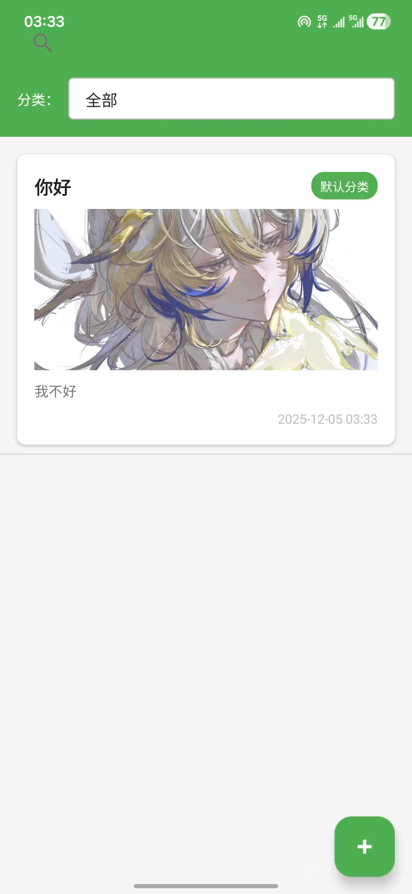
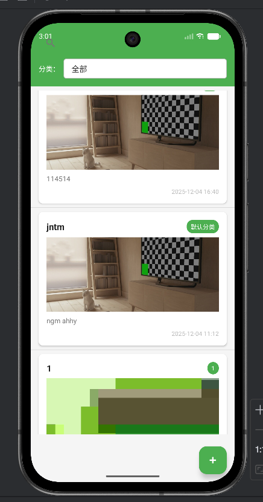

# 笔记应用 (NoteApp)
# （app运行截图在文件夹里，如果markdown不支持查看或者从github克隆之后不能正常运行
# 查看效果，这可能和作者早期使用vscode上传项目有关，请移步文件夹，
# 本app已经打包为apk文件在手机上运行，有截图）

一个基于Android平台的简单、高效的笔记管理应用，帮助用户轻松记录和管理日常笔记，支持分类管理、图片存储和实时搜索功能。

## 功能特点

### 核心功能
- ✅ **笔记管理**：创建、编辑和删除笔记
- ✅ **分类系统**：创建、选择和管理笔记分类
- ✅ **实时搜索**：根据标题和内容搜索笔记
- ✅ **分类筛选**：按分类快速筛选笔记
- ✅ **图片支持**：为笔记添加图片内容
- ✅ **时间追踪**：自动记录笔记创建和更新时间
- ✅ **简洁UI**：直观易用的用户界面

### 技术特性
- 📱 **多设备适配**：兼容各种Android设备
- 💾 **本地存储**：使用SQLite进行数据持久化
- 🎨 **现代设计**：采用Material Design设计风格
- ⚡ **高性能**：使用RecyclerView优化列表展示
- 🛡️ **稳定可靠**：完善的异常处理机制
- 📂 **清晰架构**：模块化的项目结构设计

## 技术栈

- **开发语言**: Java
- **开发框架**: Android SDK
- **数据库**: SQLite
- **UI组件**: RecyclerView, Material Design Components
- **构建工具**: Gradle
- **开发环境**: Android Studio

## 安装说明

### 前提条件
- Android Studio Arctic Fox (2020.3.1) 或更高版本
- JDK 8 或更高版本
- Android SDK API Level 21 或更高版本
- Android Build Tools 30.0.3 或更高版本

### 安装步骤

1. **克隆项目**
   ```bash
   git clone https://github.com/your-username/noteapp.git
   cd noteapp
   ```

2. **打开项目**
   - 启动Android Studio
   - 选择 "Open an existing project"
   - 导航到项目目录并选择它

3. **配置项目**
   - Android Studio会自动下载所需的依赖
   - 等待Gradle同步完成

4. **运行应用**
   - 连接Android设备或启动模拟器
   - 点击 "Run" 按钮运行应用

## 应用截图

### 笔记列表页面（注：app运行截图在文件夹里，如果markdown不支持查看请移步文件夹）

展示所有笔记，支持分类筛选和实时搜索功能。



### 笔记编辑页面

创建和编辑笔记，支持添加图片和自定义分类。



### 分类管理功能

创建新的笔记分类，方便对笔记进行组织管理。


### 搜索功能

实时搜索笔记内容，快速找到所需信息。


## 功能详解

### 1. 笔记列表页面 (NoteListActivity)

**功能说明**：展示所有笔记，支持搜索、分类筛选和创建新笔记。

**核心代码实现**：
- `setupRecyclerView()`: 初始化RecyclerView，设置布局管理器和适配器
- `loadNotes()`: 从数据库加载笔记数据，支持分类筛选
- `setupSearchView()`: 配置搜索视图，实现实时搜索功能
- `setupCategorySpinner()`: 初始化分类下拉菜单，支持分类筛选

**关键组件**：
- RecyclerView: 显示笔记列表
- SearchView: 实时搜索笔记
- Spinner: 分类筛选
- FloatingActionButton: 创建新笔记

### 2. 笔记编辑页面 (NoteEditActivity)

**功能说明**：创建和编辑笔记，支持添加图片、选择分类和保存笔记。

**核心代码实现**：
- `loadNote()`: 加载现有笔记数据（编辑模式）
- `setupCategorySpinner()`: 初始化分类选择器
- `saveNote()`: 保存笔记到数据库
- `setupImageButton()`: 配置图片选择功能

**关键组件**：
- EditText: 标题和内容输入
- Spinner: 分类选择
- Button: 保存和添加分类
- ImageView: 显示和选择图片

### 3. 分类管理功能

**功能说明**：创建和管理笔记分类，方便对笔记进行组织。

**核心代码实现**：
- `addCategory()`: 添加新分类
- `loadCategories()`: 加载所有分类
- `showAddCategoryDialog()`: 显示添加分类对话框

### 4. 搜索功能

**功能说明**：根据标题和内容实时搜索笔记。

**核心代码实现**：
- `searchNotes()`: 根据关键词搜索笔记
- `onQueryTextChange()`: 监听搜索框文本变化

### 5. 图片支持功能

**功能说明**：为笔记添加图片，丰富笔记内容。

**核心代码实现**：
- `selectImage()`: 从相册选择图片
- `saveImage()`: 保存图片到本地存储
- `loadImage()`: 加载并显示图片

## 使用方法

### 基本操作

1. **创建笔记**
   - 点击笔记列表页面右下角的 "+" 按钮
   - 输入笔记标题和内容
   - 选择或创建分类（可选）
   - 添加图片（可选）
   - 点击 "保存" 按钮

2. **编辑笔记**
   - 点击列表中的笔记项
   - 修改笔记内容、分类或图片
   - 点击 "保存" 按钮

3. **删除笔记**
   - 长按列表中的笔记项
   - 在弹出菜单中选择 "删除"

4. **搜索笔记**
   - 使用顶部的搜索框
   - 输入关键词，实时查看搜索结果

5. **管理分类**
   - 在笔记编辑页面点击分类旁边的 "+" 按钮
   - 输入新分类名称
   - 点击 "确定" 添加分类
   - 使用分类下拉菜单切换不同分类的笔记

## 项目结构

```
app/src/main/
├── java/com/example/a122ad/
│   ├── MainActivity.java        # 应用入口，直接跳转到笔记列表
│   ├── NoteListActivity.java    # 笔记列表页面
│   ├── NoteEditActivity.java    # 笔记编辑页面
│   ├── adapter/
│   │   └── NoteAdapter.java     # 笔记列表适配器
│   ├── db/
│   │   └── NoteDbHelper.java    # 数据库操作帮助类
│   └── model/
│       └── Note.java            # 笔记数据模型
└── res/
    ├── layout/
    │   ├── activity_main.xml         # 主页面布局
    │   ├── activity_note_list.xml    # 笔记列表布局
    │   ├── activity_note_edit.xml    # 笔记编辑布局
    │   └── note_item.xml             # 笔记列表项布局
    ├── values/
    │   ├── colors.xml      # 颜色资源
    │   ├── strings.xml     # 字符串资源
    │   └── styles.xml      # 样式资源
    └── drawable/
        └── spinner_background.xml    # 自定义Spinner背景
```

## 实现方法和技术应用

### 1. 架构设计

采用经典的MVC（Model-View-Controller）架构模式：

- **Model**: 数据模型层，包含Note类和数据库操作
- **View**: UI界面层，包含各种Activity和布局文件
- **Controller**: 业务逻辑层，处理用户交互和数据流转

### 2. 数据持久化

使用SQLite数据库进行本地数据存储：

**数据库设计**：
```sql
CREATE TABLE notes (
    id INTEGER PRIMARY KEY AUTOINCREMENT,
    title TEXT,
    content TEXT,
    category TEXT,
    created_at DATETIME,
    updated_at DATETIME,
    image_path TEXT
);

CREATE TABLE categories (
    id INTEGER PRIMARY KEY AUTOINCREMENT,
    name TEXT UNIQUE
);
```

**核心数据库操作类 (NoteDbHelper)**：
- 使用SQLiteOpenHelper管理数据库创建和版本升级
- 实现增删改查(CRUD)操作
- 支持事务处理，确保数据一致性

### 3. RecyclerView实现高效列表

使用RecyclerView优化笔记列表展示：

- **ViewHolder模式**：减少View的创建和查找次数
- **DiffUtil**：高效更新列表数据
- **布局管理器**：支持线性布局和网格布局
- **动画效果**：添加列表项动画，提升用户体验

### 4. 图片处理

实现笔记图片的选择、保存和加载功能：

- **Intent.ACTION_PICK**：从相册选择图片
- **FileProvider**：安全地共享文件
- **Bitmap压缩**：优化图片存储和加载性能
- **图片缓存**：减少重复加载，提升应用响应速度

### 5. 异常处理机制

建立多层异常处理体系：

- **数据库异常处理**：捕获SQLite操作异常，确保数据安全
- **UI组件异常处理**：防止空指针和布局错误
- **文件操作异常处理**：安全处理图片文件操作
- **网络异常处理**：为未来的云同步功能预留

### 6. 性能优化

应用多种性能优化策略：

- **延迟加载**：按需加载数据和图片
- **内存管理**：及时释放资源，避免内存泄漏
- **数据库索引**：优化查询性能
- **UI渲染优化**：减少布局层级，使用约束布局

### 7. Material Design应用

采用Material Design设计规范：

- **主题颜色**：统一的配色方案
- **组件设计**：使用Material组件
- **动画效果**：平滑的过渡和交互动画
- **响应式设计**：适配不同屏幕尺寸

## 核心代码说明

### 数据模型 (Note.java)
```java
public class Note implements Serializable {
    private long id;
    private String title;
    private String content;
    private String category;
    private Date createdAt;
    private Date updatedAt;
    private String imagePath;
    // getter和setter方法
}
```

### 数据库操作 (NoteDbHelper.java)
- `addNote(Note note)`: 添加新笔记到数据库
- `updateNote(Note note)`: 更新现有笔记
- `deleteNote(long id)`: 从数据库删除笔记
- `getNoteById(long id)`: 根据ID查询笔记
- `getAllNotes()`: 获取所有笔记
- `getNotesByCategory(String category)`: 按分类获取笔记
- `searchNotes(String keyword)`: 根据关键词搜索笔记

### 列表适配器 (NoteAdapter.java)
- **ViewHolder模式**：优化列表项渲染性能
- **事件回调**：处理点击和长按事件
- **数据绑定**：将笔记数据绑定到UI组件
- **日期格式化**：显示友好的时间格式

### 主活动跳转 (MainActivity.java)
```java
public class MainActivity extends AppCompatActivity {
    @Override
    protected void onCreate(Bundle savedInstanceState) {
        super.onCreate(savedInstanceState);
        setContentView(R.layout.activity_main);
        try {
            Intent intent = new Intent(MainActivity.this, NoteListActivity.class);
            startActivity(intent);
            finish();
        } catch (Exception e) {
            e.printStackTrace();
            finish();
        }
    }
}
```

## 异常处理机制

应用采用了多层异常处理机制，确保在各种异常情况下都能稳定运行：

1. **Activity初始化异常处理**
   - 捕获数据库初始化失败
   - 捕获视图初始化失败
   - 捕获RecyclerView设置失败

2. **数据库操作异常处理**
   - 捕获SQLite操作异常
   - 处理游标资源泄漏
   - 验证数据库查询结果

3. **UI交互异常处理**
   - 处理空指针异常
   - 验证用户输入
   - 确保在UI线程更新界面

## 性能优化

1. **数据库优化**
   - 合理使用索引
   - 及时关闭数据库连接
   - 批量操作减少IO开销

2. **UI优化**
   - RecyclerView复用机制
   - 延迟加载和预加载
   - 减少布局嵌套层级

3. **内存管理**
   - 避免内存泄漏
   - 及时释放资源
   - 优化对象创建和销毁

## 未来改进方向

- [ ] 添加云同步功能
- [ ] 支持笔记标签
- [ ] 实现富文本编辑
- [ ] 添加笔记提醒功能
- [ ] 支持导出笔记为PDF
- [ ] 添加夜间模式

## 贡献指南

欢迎对项目进行贡献！以下是贡献步骤：

1. Fork 本仓库
2. 创建特性分支 (`git checkout -b feature/AmazingFeature`)
3. 提交更改 (`git commit -m 'Add some AmazingFeature'`)
4. 推送到分支 (`git push origin feature/AmazingFeature`)
5. 打开 Pull Request

## 许可证

本项目采用 MIT 许可证 - 查看 [LICENSE](LICENSE) 文件了解详情。

## 作者

**NoteApp 开发者**