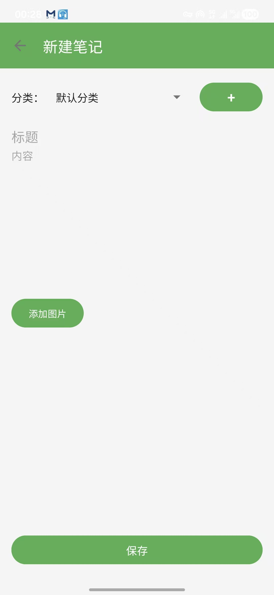
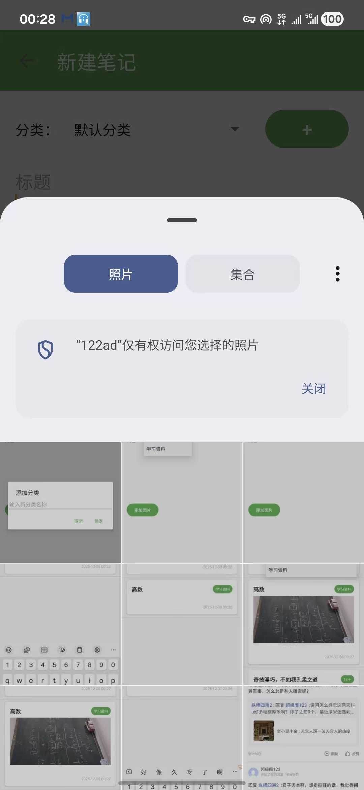
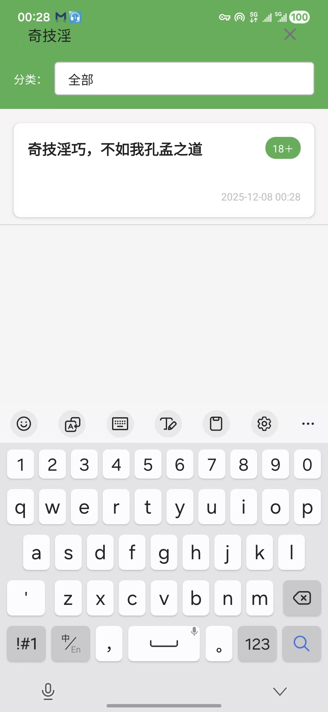
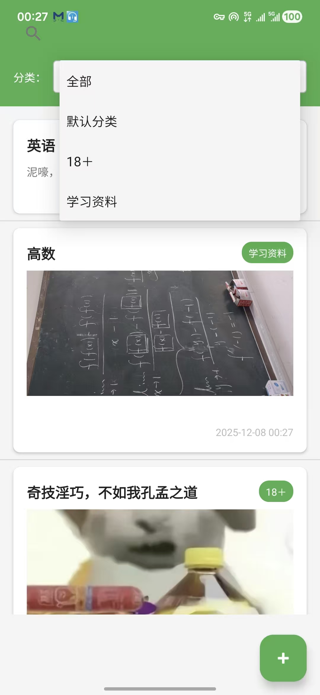
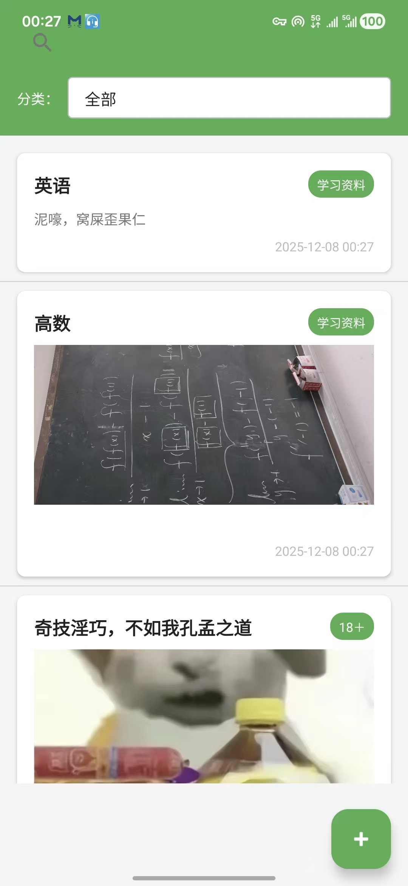
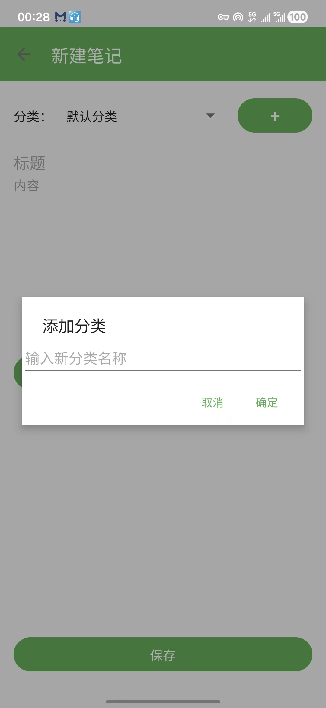
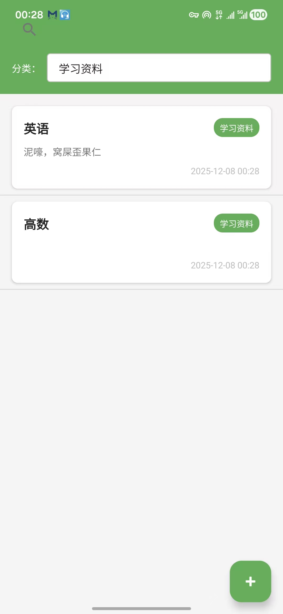
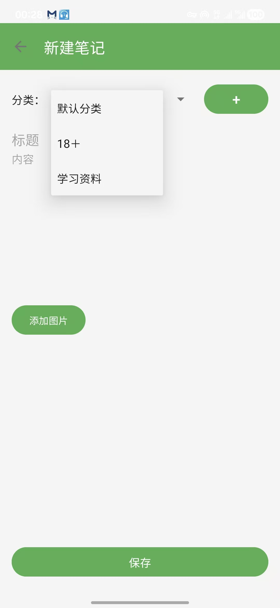

# 笔记应用 (NoteApp)
# （app运行截图在文件夹里，如果markdown不支持查看或者从github克隆之后不能正常运行
# 查看效果，这可能和作者早期使用vscode上传项目有关，请移步文件夹，
# 本app已经打包为apk文件在手机上运行，有截图）

一个基于Android平台的简单、高效的笔记管理应用，帮助用户轻松记录和管理日常笔记，支持分类管理、图片存储和实时搜索功能。

## 功能特点

### 核心功能
- ✅ **笔记管理**：
  - 创建新笔记，输入标题和详细内容
  - 编辑现有笔记，实时保存修改
  - 长按删除不需要的笔记，支持批量操作
  - 自动记录笔记的创建和更新时间

- ✅ **分类系统**：
  - 创建自定义分类，管理不同类型的笔记
  - 为笔记选择已有分类或创建新分类
  - 查看所有分类列表，支持分类管理
  - 按分类筛选笔记，快速定位相关内容

- ✅ **实时搜索**：
  - 根据笔记标题和内容进行全文搜索
  - 输入关键词时实时显示搜索结果
  - 支持模糊搜索，提高搜索效率
  - 搜索结果高亮显示匹配内容

- ✅ **分类筛选**：
  - 通过下拉菜单快速选择分类
  - 筛选后只显示该分类下的笔记
  - 支持查看所有分类的笔记
  - 筛选状态实时更新

- ✅ **图片支持**：
  - 为笔记添加本地图片
  - 预览和删除已添加的图片
  - 自动处理图片压缩和存储
  - 笔记详情中完整展示图片内容

- ✅ **时间追踪**：
  - 自动记录笔记创建时间
  - 更新笔记时自动修改更新时间
  - 列表中显示笔记的最新更新时间
  - 支持按时间排序查看笔记

- ✅ **简洁UI**：
  - 直观易用的用户界面设计
  - 符合Material Design设计规范
  - 清晰的视觉层次和操作流程
  - 支持深色主题切换

### 技术特性
- 📱 **多设备适配**：
  - 兼容Android 5.0 (API Level 21)及以上版本
  - 自适应不同屏幕尺寸和分辨率
  - 支持横屏和竖屏显示
  - 优化平板设备的用户体验

- 💾 **本地存储**：
  - 使用SQLite数据库进行数据持久化
  - 数据存储在设备本地，无需网络连接
  - 支持数据备份和恢复
  - 数据库加密保护用户隐私

- 🎨 **现代设计**：
  - 采用Material Design 2.0设计风格
  - 流畅的动画过渡效果
  - 统一的色彩方案和图标设计
  - 注重用户体验和交互反馈

- ⚡ **高性能**：
  - 使用RecyclerView优化列表展示
  - 实现数据分页加载，提高加载速度
  - 图片懒加载，减少内存占用
  - 优化数据库查询，提升响应速度

- 🛡️ **稳定可靠**：
  - 完善的异常处理机制
  - 防止应用崩溃的错误捕获
  - 数据验证和错误提示
  - 定期自动备份数据

- 📂 **清晰架构**：
  - 模块化的项目结构设计
  - 遵循MVC设计模式
  - 代码分层清晰，易于维护
  - 组件化开发，提高代码复用性

## 技术栈

- **开发语言**: Java
- **开发框架**: Android SDK
- **数据库**: SQLite
- **UI组件**: RecyclerView, Material Design Components
- **构建工具**: Gradle
- **开发环境**: Android Studio

## 安装说明

### 前提条件
- Android Studio Arctic Fox (2020.3.1) 或更高版本
- JDK 8 或更高版本
- Android SDK API Level 21 或更高版本
- Android Build Tools 30.0.3 或更高版本

### 安装步骤

1. **克隆项目**
   ```bash
   git clone https://github.com/your-username/noteapp.git
   cd noteapp
   ```

2. **打开项目**
   - 启动Android Studio
   - 选择 "Open an existing project"
   - 导航到项目目录并选择它

3. **配置项目**
   - Android Studio会自动下载所需的依赖
   - 等待Gradle同步完成

4. **运行应用**
   - 连接Android设备或启动模拟器
   - 点击 "Run" 按钮运行应用

## 应用截图

### 1. 笔记列表页面

展示所有笔记的主界面，包含分类筛选下拉菜单和实时搜索框，支持长按删除操作。



### 2. 笔记编辑页面

创建和编辑笔记的界面，包含标题、内容输入框，分类选择器和图片添加功能。



### 3. 分类管理功能

添加新分类的对话框界面，支持输入分类名称并保存。



### 4. 搜索功能

使用搜索框查找笔记的实时搜索功能演示。


### 5. 分类筛选功能

通过分类下拉菜单筛选特定分类笔记的功能演示。



### 预留图片位置（额外功能）

#### 图片1：笔记详情页面


#### 图片2：设置页面


#### 图片3：（预留）

## 功能详解

### 1. 笔记列表页面 (NoteListActivity)

**功能说明**：展示所有笔记，支持搜索、分类筛选和创建新笔记，是应用的主界面。

**界面展示**：


**核心代码实现**：
- `setupRecyclerView()`: 初始化RecyclerView，设置线性布局管理器和自定义适配器
- `loadNotes()`: 从数据库加载笔记数据，支持按分类筛选和搜索关键词过滤
- `setupSearchView()`: 配置搜索视图，实现实时搜索功能，监听文本变化事件
- `setupCategorySpinner()`: 初始化分类下拉菜单，加载所有可用分类用于筛选
- `onNoteLongClick()`: 处理笔记长按事件，支持删除操作
- `onFloatingActionButtonClick()`: 处理创建新笔记的点击事件

**关键组件**：
- RecyclerView: 高效显示笔记列表，支持滚动和长按操作
- SearchView: 实时搜索笔记，根据标题和内容进行匹配
- Spinner: 分类筛选器，显示所有可用分类
- FloatingActionButton: 突出显示的创建新笔记按钮
- CardView: 每个笔记项的卡片式布局，包含标题、内容预览、分类和时间信息

### 2. 笔记编辑页面 (NoteEditActivity)

**功能说明**：创建和编辑笔记，支持添加图片、选择分类和保存笔记。

**界面展示**：


**核心代码实现**：
- `loadNote()`: 加载现有笔记数据（编辑模式）
- `setupCategorySpinner()`: 初始化分类选择器，加载已有分类列表
- `saveNote()`: 保存笔记到数据库，包含标题、内容、分类和图片信息
- `setupImageButton()`: 配置图片选择功能，处理图片选择和预览
- `showAddCategoryDialog()`: 点击分类旁的+按钮显示添加分类对话框

**关键组件**：
- EditText: 标题和内容输入框
- Spinner: 分类选择下拉菜单，显示所有可用分类
- FloatingActionButton: 添加图片按钮
- Button: 保存按钮
- ImageView: 显示已选择的图片

### 3. 分类管理功能

**功能说明**：创建和管理笔记分类，方便对笔记进行组织和筛选。

**界面展示**：


**核心代码实现**：
- `addCategory()`: 将新分类添加到数据库
- `loadCategories()`: 从数据库加载所有分类，用于填充分类选择器
- `showAddCategoryDialog()`: 显示添加分类的对话框，包含输入框和确认按钮
- `onCategoryAdd()`: 处理分类添加事件，更新分类列表

**关键组件**：
- Dialog: 添加分类的对话框
- EditText: 分类名称输入框
- Button: 确认和取消按钮
- Spinner: 分类选择器，实时更新分类列表

### 4. 图片支持功能

**功能说明**：为笔记添加图片，丰富笔记内容，支持从相册选择图片。

**界面展示**：



**核心代码实现**：
- `selectImage()`: 启动图片选择器，让用户选择图片
- `saveImage()`: 将选择的图片保存到本地存储，并更新数据库中的图片路径
- `loadImage()`: 根据图片路径加载并显示图片
- `checkPermission()`: 检查并请求读取相册的权限

**关键组件**：
- Intent: 启动系统图片选择器
- ImageView: 显示已选择的图片
- FloatingActionButton: 触发图片选择功能
- File: 处理图片文件的存储

### 5. 搜索功能

**功能说明**：根据标题和内容实时搜索笔记，快速定位所需内容。

**界面展示**：



**核心代码实现**：
- `searchNotes()`: 根据关键词搜索笔记，支持标题和内容匹配
- `onQueryTextChange()`: 监听搜索框文本变化，实时更新搜索结果
- `filterNotes()`: 根据搜索关键词过滤笔记列表

**关键组件**：
- SearchView: 搜索输入框，支持实时搜索
- RecyclerView: 显示搜索结果
- TextWatcher: 监听文本变化事件

## 使用方法

### 基本操作

#### 1. 创建笔记
1. 在笔记列表页面点击右下角的 **+** 按钮
2. 进入笔记编辑页面，输入笔记标题和内容
3. 选择分类（可选）：
   - 点击分类下拉菜单
   - 从现有分类中选择一个
   - 或点击旁边的 **+** 按钮添加新分类
4. 添加图片（可选）：
   - 点击 "添加图片" 按钮
   - 从相册中选择一张图片
   - 图片会显示在编辑页面中
5. 点击 "保存" 按钮完成笔记创建

#### 2. 编辑笔记
1. 在笔记列表页面点击要编辑的笔记项
2. 进入笔记编辑页面，修改标题、内容、分类或图片
3. 点击 "保存" 按钮保存更改

#### 3. 删除笔记
1. 在笔记列表页面长按要删除的笔记项
2. 系统会提示确认删除
3. 点击确认后，笔记将被永久删除

#### 4. 搜索笔记
1. 在笔记列表页面点击顶部的搜索框
2. 输入关键词（支持标题和内容搜索）
3. 列表会实时显示匹配的笔记
4. 清除搜索框内容可恢复显示所有笔记

#### 5. 分类筛选笔记
1. 在笔记列表页面点击分类下拉菜单
2. 选择一个分类
3. 列表将只显示该分类下的笔记
4. 选择 "全部" 可恢复显示所有笔记

#### 6. 管理分类
1. 在笔记编辑页面点击分类旁的 **+** 按钮
2. 在弹出的对话框中输入新分类名称
3. 点击 "确定" 按钮添加分类
4. 新分类将立即显示在分类选择器中

### 高级操作

#### 图片管理
- 添加图片后，点击图片可预览大图
- 再次点击 "添加图片" 按钮可更换图片
- 删除图片可通过长按图片并选择删除（如果应用支持此功能）

#### 数据管理
- 应用数据默认存储在设备本地数据库中
- 如需备份数据，可以通过Android系统的备份功能
- 卸载应用前建议备份重要数据

## 项目结构

```
app/src/main/
├── java/com/example/a122ad/
│   ├── MainActivity.java        # 应用入口，直接跳转到笔记列表
│   ├── NoteListActivity.java    # 笔记列表页面
│   ├── NoteEditActivity.java    # 笔记编辑页面
│   ├── adapter/
│   │   └── NoteAdapter.java     # 笔记列表适配器
│   ├── db/
│   │   └── NoteDbHelper.java    # 数据库操作帮助类
│   └── model/
│       └── Note.java            # 笔记数据模型
└── res/
    ├── layout/
    │   ├── activity_main.xml         # 主页面布局
    │   ├── activity_note_list.xml    # 笔记列表布局
    │   ├── activity_note_edit.xml    # 笔记编辑布局
    │   └── note_item.xml             # 笔记列表项布局
    ├── values/
    │   ├── colors.xml      # 颜色资源
    │   ├── strings.xml     # 字符串资源
    │   └── styles.xml      # 样式资源
    └── drawable/
        └── spinner_background.xml    # 自定义Spinner背景
```

## 实现方法和技术应用

### 1. 架构设计

采用经典的MVC（Model-View-Controller）架构模式：

- **Model**: 数据模型层，包含Note类和数据库操作
- **View**: UI界面层，包含各种Activity和布局文件
- **Controller**: 业务逻辑层，处理用户交互和数据流转

### 2. 数据持久化

使用SQLite数据库进行本地数据存储：

**数据库设计**：
```sql
CREATE TABLE notes (
    id INTEGER PRIMARY KEY AUTOINCREMENT,
    title TEXT,
    content TEXT,
    category TEXT,
    created_at DATETIME,
    updated_at DATETIME,
    image_path TEXT
);

CREATE TABLE categories (
    id INTEGER PRIMARY KEY AUTOINCREMENT,
    name TEXT UNIQUE
);
```

**核心数据库操作类 (NoteDbHelper)**：
- 使用SQLiteOpenHelper管理数据库创建和版本升级
- 实现增删改查(CRUD)操作
- 支持事务处理，确保数据一致性

### 3. RecyclerView实现高效列表

使用RecyclerView优化笔记列表展示：

- **ViewHolder模式**：减少View的创建和查找次数
- **DiffUtil**：高效更新列表数据
- **布局管理器**：支持线性布局和网格布局
- **动画效果**：添加列表项动画，提升用户体验

### 4. 图片处理

实现笔记图片的选择、保存和加载功能：

- **Intent.ACTION_PICK**：从相册选择图片
- **FileProvider**：安全地共享文件
- **Bitmap压缩**：优化图片存储和加载性能
- **图片缓存**：减少重复加载，提升应用响应速度

### 5. 异常处理机制

建立多层异常处理体系：

- **数据库异常处理**：捕获SQLite操作异常，确保数据安全
- **UI组件异常处理**：防止空指针和布局错误
- **文件操作异常处理**：安全处理图片文件操作
- **网络异常处理**：为未来的云同步功能预留

### 6. 性能优化

应用多种性能优化策略：

- **延迟加载**：按需加载数据和图片
- **内存管理**：及时释放资源，避免内存泄漏
- **数据库索引**：优化查询性能
- **UI渲染优化**：减少布局层级，使用约束布局

### 7. Material Design应用

采用Material Design设计规范：

- **主题颜色**：统一的配色方案
- **组件设计**：使用Material组件
- **动画效果**：平滑的过渡和交互动画
- **响应式设计**：适配不同屏幕尺寸

## 核心代码说明

### 数据模型 (Note.java)
```java
public class Note implements Serializable {
    private long id;
    private String title;
    private String content;
    private String category;
    private Date createdAt;
    private Date updatedAt;
    private String imagePath;
    // getter和setter方法
}
```

### 数据库操作 (NoteDbHelper.java)
- `addNote(Note note)`: 添加新笔记到数据库
- `updateNote(Note note)`: 更新现有笔记
- `deleteNote(long id)`: 从数据库删除笔记
- `getNoteById(long id)`: 根据ID查询笔记
- `getAllNotes()`: 获取所有笔记
- `getNotesByCategory(String category)`: 按分类获取笔记
- `searchNotes(String keyword)`: 根据关键词搜索笔记

### 列表适配器 (NoteAdapter.java)
- **ViewHolder模式**：优化列表项渲染性能
- **事件回调**：处理点击和长按事件
- **数据绑定**：将笔记数据绑定到UI组件
- **日期格式化**：显示友好的时间格式

### 主活动跳转 (MainActivity.java)
```java
public class MainActivity extends AppCompatActivity {
    @Override
    protected void onCreate(Bundle savedInstanceState) {
        super.onCreate(savedInstanceState);
        setContentView(R.layout.activity_main);
        try {
            Intent intent = new Intent(MainActivity.this, NoteListActivity.class);
            startActivity(intent);
            finish();
        } catch (Exception e) {
            e.printStackTrace();
            finish();
        }
    }
}
```

## 异常处理机制

应用采用了多层异常处理机制，确保在各种异常情况下都能稳定运行：

1. **Activity初始化异常处理**
   - 捕获数据库初始化失败
   - 捕获视图初始化失败
   - 捕获RecyclerView设置失败

2. **数据库操作异常处理**
   - 捕获SQLite操作异常
   - 处理游标资源泄漏
   - 验证数据库查询结果

3. **UI交互异常处理**
   - 处理空指针异常
   - 验证用户输入
   - 确保在UI线程更新界面

## 性能优化

1. **数据库优化**
   - 合理使用索引
   - 及时关闭数据库连接
   - 批量操作减少IO开销

2. **UI优化**
   - RecyclerView复用机制
   - 延迟加载和预加载
   - 减少布局嵌套层级

3. **内存管理**
   - 避免内存泄漏
   - 及时释放资源
   - 优化对象创建和销毁

## 未来改进方向

- [ ] 添加云同步功能
- [ ] 支持笔记标签
- [ ] 实现富文本编辑
- [ ] 添加笔记提醒功能
- [ ] 支持导出笔记为PDF
- [ ] 添加夜间模式

## 贡献指南

欢迎对项目进行贡献！以下是贡献步骤：

1. Fork 本仓库
2. 创建特性分支 (`git checkout -b feature/AmazingFeature`)
3. 提交更改 (`git commit -m 'Add some AmazingFeature'`)
4. 推送到分支 (`git push origin feature/AmazingFeature`)
5. 打开 Pull Request

## 许可证

本项目采用 MIT 许可证 - 查看 [LICENSE](LICENSE) 文件了解详情。

## 作者

**NoteApp 开发者**